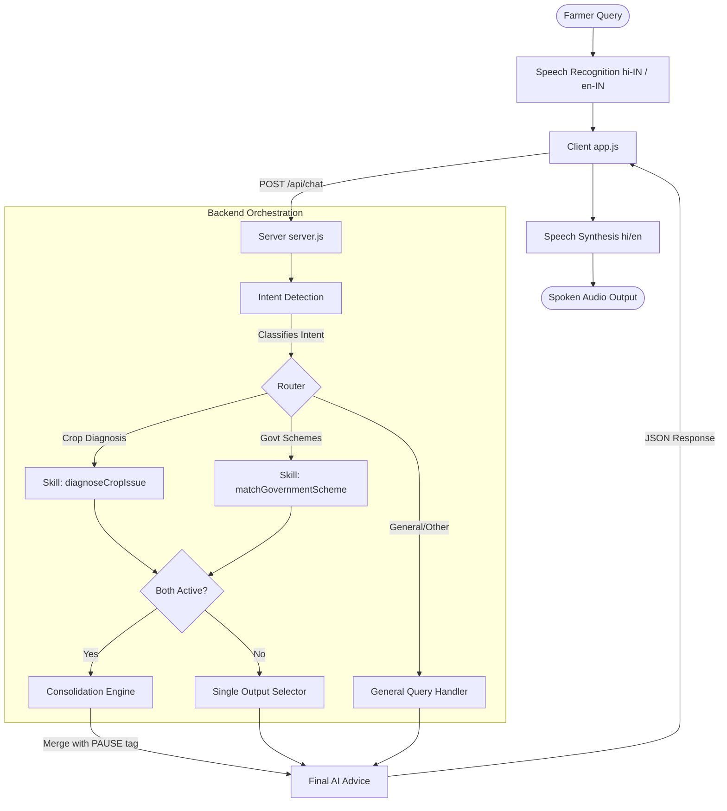

# KisanSathi (किसानसाथी) 🌾🔊
> **Your Voice-First AI Assistant for Indian Farmers**

KisanSathi is a mobile-responsive, voice-first web application designed to empower Indian farmers with direct access to agricultural expertise and government support. It solves the critical accessibility challenges of language barriers, technical complexity, and unstable internet access in rural areas.

---

## 💡 The Problem KisanSathi Solves
Indian farmers frequently encounter crop diseases, pest infestations, and soil nutrient deficiencies that threaten their livelihood. While government schemes and organic remedies exist, farmers struggle to access them due to:
- **Literacy & Technical Barriers:** Complex web portals are difficult to navigate.
- **Language Barriers:** Valuable agricultural advisories are often not available in regional languages.
- **Connectivity Issues:** Unstable internet in remote agricultural fields prevents reliance on heavy cloud-based apps.

**KisanSathi** addresses these problems by providing an audio-driven, talk-to-ask interface where farmers can hold a microphone button, ask a query in Hindi or English, and receive an instant, spoken response with actionable, low-cost organic remedies and scheme matchings.

---

## 🛠️ Architecture & Skill Orchestration
KisanSathi is built with a lightweight Node.js/Express backend and a responsive, vanilla CSS/JS frontend, powered by the **Google Gemini 2.5 Flash** model.



### 1. Primary Agent Skills
- **`diagnoseCropIssue` (Crop Diagnosis):** Focuses on plant health, diagnosing crop diseases, nutrient deficiencies, or water issues. It prioritizes practical, low-cost, natural/organic remedies first, followed by safe chemical recommendations.
- **`matchGovernmentScheme` (Scheme Matching):** Queries an agricultural schemes database (`schemes.json`) loaded in memory. It matches eligibility, benefits, and application steps for major schemes, or suggests general fallbacks (like PM-KISAN or KCC).

### 2. Intent Orchestration
Every query sent to `/api/chat` undergoes an initial intent detection step using a structured JSON schema. If the system detects **both** crop issues and scheme queries, the backend executes both skills in parallel, then feeds the individual outputs into a **Consolidation Engine**. This engine merges the content into a single cohesive response, inserting a `[PAUSE]` tag between the segments for natural voice synthesis.

---

## 🗣️ Bilingual Voice Support
To support diverse user bases, KisanSathi offers a fully-localized, bilingual interface (Hindi & English):
* **Language Toggle:** A header toggle instantly updates all buttons, prompts, suggestions, and placeholders.
* **Bilingual Speech-to-Text:** Configures HTML5 `SpeechRecognition` dynamically to `hi-IN` (Hindi) or `en-IN` (English) based on the user's preference.
* **Bilingual Speech-to-Speech:** Locates and loads high-quality local text-to-speech voices for Hindi and English.
* **Audio-Friendly Prompts:** System prompts instruct Gemini to format outputs to be under 120 words, using simple phrasing optimized for text-to-speech.

---

## 🔌 Robust Offline Fallback Feature
Farmers often lose internet access in the fields. KisanSathi features a **structured offline fallback architecture**:

- **Auto-Switching:** If the backend detects a network error, missing API credentials, API failures, or if `FORCE_OFFLINE_MODE=true` is enabled, it flips the UI badge to **Offline**.
- **Keyword & Intent Matching:** The frontend contains a client-side database (`app.js`) covering major crops (Wheat, Paddy, Potato, Tomato) and key categories (pests vs. diseases).
- **Structured Offline Databases:** Matches queries to local schemes (PM-KISAN, KCC, PMFBY, PMKSY, SMAM, Soil Health Card) in the selected language.
- **Graceful Failures:** If no keywords match, the system guides the farmer to simplify their query or check their connection.

---

## 🚀 Local Setup Instructions
Follow these steps to run KisanSathi on your local machine:

### 1. Prerequisites
Ensure you have [Node.js](https://nodejs.org/) installed (version `>= 18.0.0` is recommended).

### 2. Install Dependencies
Clone this repository to your local drive, navigate to the folder, and install the required modules:
```bash
npm install
```

### 3. Environment Configuration
Create a `.env` file by copying the template:
```bash
cp .env.example .env
```
Open `.env` and fill in your Gemini API key:
```env
PORT=3000
GEMINI_API_KEY=your_actual_gemini_api_key_here
FORCE_OFFLINE_MODE=false
```

### 4. Start the Application
Run the Express development server:
```bash
npm start
```
Open your browser and visit: `http://localhost:3000`

---

## 🎓 Project Acknowledgement
This project was developed for **Kaggle's AI Agents Intensive Vibe Coding Capstone Project** using **Google Antigravity**. It demonstrates the design of highly-resilient, voice-driven AI agents targeting critical real-world accessibility and offline usage constraints.
